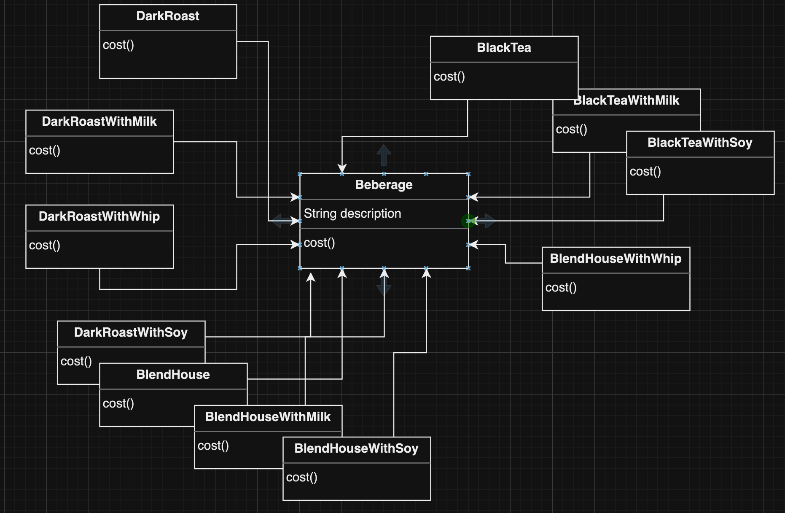
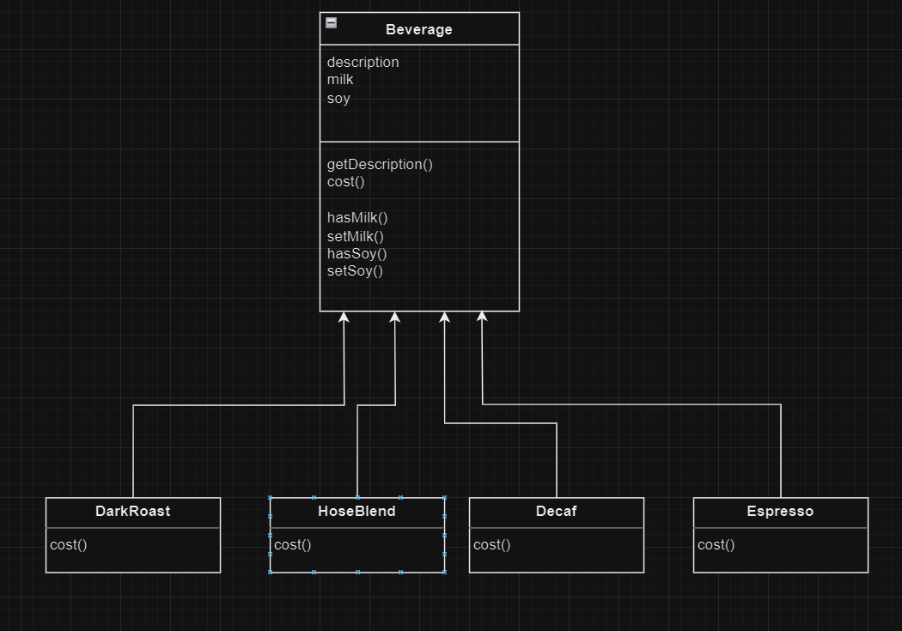
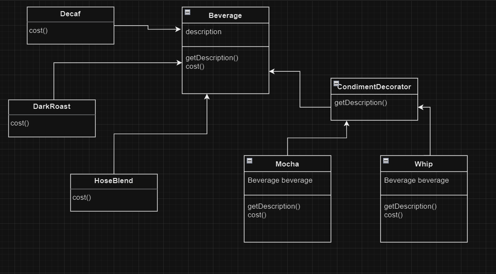

## 변화에 유연한 음료 주문 시스템 *feat.Decorator Pattern*

### 1. 초창기 주문 시스템 구조<br>
초창기 주문 시스템은 Beverage 슈퍼 클래스 상속을 남용하고 있습니다.<br>




모든 음료는 Beverage 슈퍼클래스를 상속하여 음료 가격 메서드를 모든 음료 자신의 클래스에서 오버라이드 하고 있습니다.
이로 인해 무수히 많은 음료 클래스가 존재하여 음료의 가격이 변동되거나, 첨가물의 가격이 변동되는 등의 변화를 시스템에 적용하려면 많은 시간을 써야 합니다.<br>


### 2. 첨가물을 슈퍼클래스에 관리한다면?!
초창기 주문 시스템에서는 첨가물이 추가됨에 따라 새로운 음료 클래스를 만들어야 했기에 많은 양의 클래스를 작성하는것이 불가피 했습니다.<br>
그렇다면 첨가물을 Beverage 클래스에서 관리해주고 첨가물의 가격을 계산 해준다면 작성해야할 클래스의 수는 현저히 줄어들게 되고, 첨가물 가격 변동에 꽤 유연한 구조가 될 수  있습니다.<br>



```java
 public class Beverage {
        String description = "";
        double milkCost=0.5;
        boolean milk = false;
        String getDescription(){
            if(hasMilk())
                description += ",우유";
            return this.description;
        }
        public boolean hasMilk() {
            return milk;
        }
        public void setMilk(){
            this.milk = true;
        }
        double cost(){
            double condimentCost = 0.0;
            if(hasMilk())
                condimentCost += milkCost;
            return condimentCost;
        }
    }
```

```java
public class DarkRoast extends Beverage{
    @Override
    double cost(){
        return 1.0 + super.cost();
    }
    @Override
    String getDescription(){
        return "다크로스트" + super.getDescription();
    }
}
```
```java
public class Main {
    public static void main(String[] args) {
        Beverage darkRoast = new DarkRoast();
        System.out.println(darkRoast.cost());
        System.out.println(darkRoast.getDescription());
        darkRoast.setMilk();
        System.out.println(darkRoast.cost());
        System.out.println(darkRoast.getDescription());
    }
}
```


하지만 모든 첨가물을 슈퍼클래스에서 관리하다보니 특정 첨가물이 들어갈수 없는 음료에 해당 첨가물이 들어가는 등 예상치 못한 동작을 야기할 수 있습니다.<br>
또한 첨가물의 가격 변동에는 유연하지만, 첨가물 추가 시 **기존 클래스 코드**에 첨가물에 관한 내용을 추가해야 하기 때문에 새로운 첨가물의 추가에 대해서는 유연하지 못한 구조입니다.<br>
같은 첨가물을 반복해서 추가 할 수 없다는 문제도 있습니다.


#### 잠깐! 유연한 구조란 무엇일까 고민 해봅시다!
>추가 사항이 있을때 기존의 클래스 코드를 최대한 건드리지 않는것이 좋습니다.<br>
왜냐하면 지금의 음료주문 시스템은 간단해서 변경사항을 반영하는것이 쉬어 보이지만<br>
규모가 있는 프로젝트에서는 하나의 변경사항이 수많은 버그를 야기 할 수 있기 때문입니다.<br>

#### 디자인 원칙 : OCP(Open Close Principle)
>클래스는 변경에 닫혀 있고 확장에는 열려 있어야 합니다.<br>
위의 디자인은 수정 사항이 생길때 마다, 클래스 코드를 변경 해야 했기 때문에 OCP 디자인 원칙을 지키지 못하였습니다.<br>
**OCP 디자인 원칙을 지키며! 음료주문 시스템을 다시 설계 해봅시다!**
<br>


### 3. 객체 구성을 활용하여 Decorator Pattren 으로 디자인
> #### 목표
> 1. 새로운 첨가물을 시스템에 등록할때 기존 코드를 최대한 변경하지 않습니다.(OCP 디자인 원칙)
> 2. 첨가물을 실행 중 동적으로 추가 하도록 구현 합니다.




```java
public abstract class Beverage {
    String description = "";
    abstract double cost();
    String getDescription(){
        return this.description;
    }
}
```

```java
public class DarkRoast extends Beverage{
    public DarkRoast(){
        description = "다크로스트";
    }
    public double cost(){
        return 0.5;
    }
}
```

```java
public abstract class CondimentDecorator extends Beverage{
    abstract String getDescription();
}
```
> CondimentDecorator 클래스는 모든 첨가물(데코레이터)들의 슈퍼클래스 입니다.
> Beverage의 서브클래스로 만든이유는 행동을 상속 받는것이 아닌 형식을 맞추기 위해서 입니다.

```java
public class Mocha extends CondimentDecorator{

	Beverage beverage;
    
    public Mocha(Beverage beverage){
        this.beverage = beverage;
    }
    public String getDescription(){
        return beverage.getDescription() +",모카";
    }
    public double cost(){
        return beverage.cost() + .20;
    }
}
```
> 첨가물(데코레이터) 클래스에서는 객체 구성을 활용하여 Decorator Pattern 디자인을 완성합니다.

```java
public class Main {
    public static void main(String[] args) {
        Beverage beverage1 = new DarkRoast();
        System.out.println(beverage1.cost());
        System.out.println(beverage1.getDescription());

        beverage1 = new Mocha(beverage1);
        System.out.println(beverage1.cost());
        System.out.println(beverage1.getDescription());

        beverage1 = new Whip(beverage1);
        System.out.println(beverage1.cost());
        System.out.println(beverage1.getDescription());
    }
}
```


> #### Decorator Pattern 을 활용하며 얻은 구조적 이득
> 서비스에서 첨가물이 추가되더라도 새로운 첨가물(데코레이터) 클래스만 작성하고, 기존의 클래스를 **변경 ** 하지 않아도 됩니다.
> 또한 첨가물을 동적으로 추가 할 수 있으며 같은 첨가물도 반복해서 첨가 할 수 있습니다.


#### 실제 사용 라이브러리

- java.io
