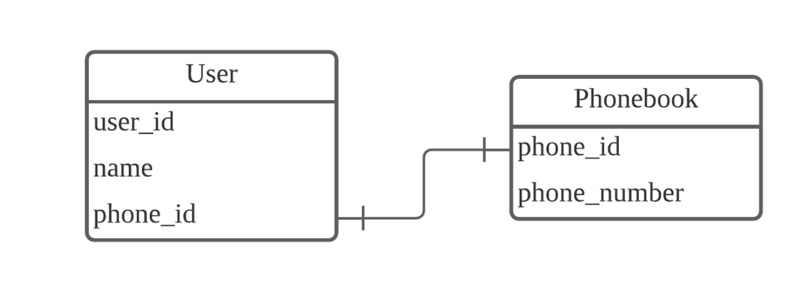
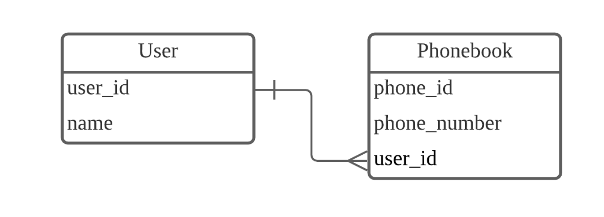
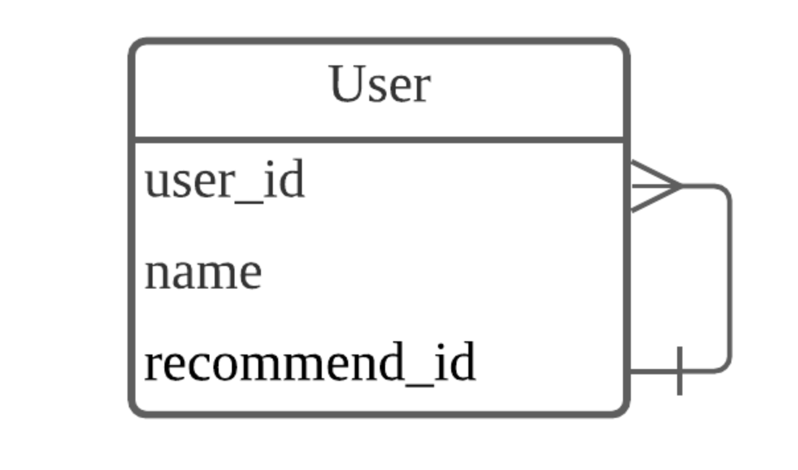
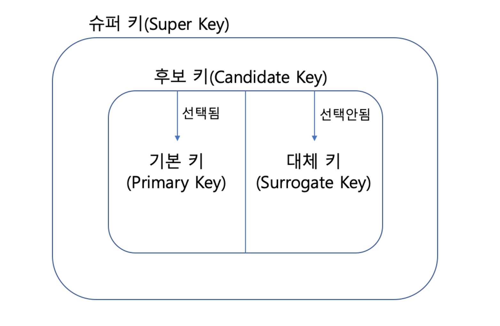

# 관계형 데이터 베이스의 기본요소

## 0. 목차

#### 1. 관계의 종류
#### 2. Key
#### 3. SQL을 활용한 데이터베이스 조작
#### 4. RDB의 장단점 및 특징
#### 5. RDB 활용 사례


## 1. 관계의 종류

### 1-1.  1:1 관계

- 하나의 레코드가 다른 테이블의 한 개의 레코드와 연결된 관계 
> 
- 유저마다 하나의 전화번호만을 가지고 있고 전화번호마다 하나의 유저를 가지고 있습니다.
- user 테이블에 phone_id를 대신하여 phone_number를 저장하는 방식으로 대체 할 수 있습니다.

### 1-2. 1:N 관계

- 하나의 레코드가 서로 다른 여러개의 레코드에 연결된 관계
> 
- 한명의 사용자는 여러개의 전화번호를 가질 수 있지만 한 개의 전화번호는 여러명의 유저를 가질 수 없습니다.
- 일반적으로 가장 많이 사용되는 관계 형태입니다.


### 1-3. N:M 관계

- 여러개의 레코드가 다른 테이블의 여러 레코드와 연결된 관계 입니다.
- 1:N 테이블을 두개 만들고 Join 테이블을 사용하여 N:M 관계를 만들 수 있습니다.
> 
- Join 테이블은 반드시 기본키를 가지고 있어야 합니다.
- customer_package 테이블에서는 고객 한 명이 여러 개의 여행 상품을 가질 수 있고, 여행 상품 하나가 여러 개의 고객을 가질 수 있습니다.

### 1-4. 자기 참조 관계

- 하나의 테이블에서 관계를 지어야 하는 경우 입니다.
> 
-  한 명의 사용자(user_id)는 한 명의 추천인(recommend_id)을 가질 수 있고,한 명의 추천인(recommend_id)은 여러 명의 사용자(user_id)에게 추천인으로 등록될 수 있으므로 1:N 관계와 유사하지만 1:N 관계는 다른 테이블과의 관계를 표현한다는 점에서 차이가 있습니다.


## 2. Key

### 2-1. Key의 개념

키(Key)는 데이터베이스에서 조건에 만족하는 튜플을 찾거나 순서대로 정렬할 때 다른 튜플들과 구별할 수 있는 유일한 기준이 되는 Attribute(속성)입니다. 

> 튜플 : 릴레이션을 구성하는 각각의 행, 속성의 모임으로 구성됩니다. 파일 구조에서는 레코드와 같은 개념입니다.

### 2-2. Key의 종류

> 
- 슈퍼키 : 유일성을 만족하는 키
- 후보키 : 슈퍼키들 중 최소성을 만족하는 키
- 기본키 : 후보키 중 선택된 키 
- 대체키 : 후보키 중 선택되지 않은 키 
- 외래키 : 어떤 테이블간의 관계를 나타내기 위해 다른 테이블의 기본키를 참조하는 속성

*외래키를 사용하는 테이블 간 주의할 점*
>
1.부모 테이블(참조 될)이 먼저 생성 되어야 합니다.
2.자식 테이블(참조 하는)이 먼저 삭제 되어야 합니다.

## 3.SQL을 이용한 데이터베이스 조작

### 3-1. DDL (Data Define Language)

데이터 정의어는 데이터 구조를 정의하는 언어입니다.
그래서 Table, View, Sequence, Index 등 DB Schema를 정의할 때 사용 됩니다.

규모있는 조직에서는 DBA에게만 권한을 줍니다.

- CREATE : 데이터 구조 생성

```sql
CREATE DATABASE practice DEFAULT CHARACTER SET utf8 COLLATE utf8_general_ci;

CREATE TABLE sample (
    no NUMBER NOT NULL,
    a VARCHAR(30),
    b DATE
);
```
- DROP : 데이터 구조 삭제
```sql
DROP TABLE sample;
```
- ALTER : 데이터 구조 변경
```sql
//컬럼 추가
ALTER TABLE sample62 ADD newcol NUMBER; 
//컬럼 타입 수정
ALTER TABLE sample62 MODIFY newcol VARCHAR(20);
//컬럼 이름 수정
ALTER TABLE sample62 RENAME COLUMN newcol TO c;
//컬럼 삭제
ALTER TABLE sample62 DROP COLUMN c;
```
- TRUNCATE : 데이터 구조 초기화
> DML 의 DELETE와 차이점은 TRUNCATE 는 행 데이터 뿐만 아니라 행 자체를 삭제 합니다.
또한 DROP 명령어와의 차이점은 DROP 명령어는 테이블 자체를 지우지만 TRUNCATE는 테이블 자체는 남아있고 테이블의 모든 행과 모든 데이터를 지우는 명령어 입니다.

### 3-2. DML (Data Manipulation Language)

데이터 조작어는 저장된 데이터를 조작하는 언어입니다.
실제 데이터를 활용하는 단계로 보통 개발자들에게도 권한이 있습니다.

SELECT의 경우 DQL로 상세 분류를 하기도 합니다.

- SELECT
- INSERT
- UPDATE
- DELETE

#### SELECT
- SELECT 구문은 데이터베이스로 부터 데이터를 선택(select) 하기 위해 사용됩니다.
- 반환된 데이터는 result-set이라고 불리는 result table에 저장됩니다.
- 모든 필드를 선택하고 싶다면 '*'을 이용합니다.

```sql
-- 모든 column을 선택할 땐 '*'
SELECT LastName, FirstName
FROM Employees;

-- Employees 테이블로 부터 가져온 결과
LastName	FirstName
Davolio	    Nancy
Fuller	    Andrew
Leverling	Janet
Peacock	    Margaret
Buchanan	Steven
Suyama	    Michael
King	    Robert
Callahan	Laura
Dodsworth	Anne
West	    Adam
```

#### UPDATE

- UPDATE문을 사용하여 WHERE절의 탐색 조건을 충족시키는 각 행에서 하나 이상의 열 값을 변경할 수 있습니다.

```sql
UPDATE table-name
     SET column-1 = value-1,
         column-2 = value-2, ...
     WHERE search-condition ...
```

#### DELETE
- 테이블에서 행을 제거하려면 DELETE문을 사용합니다.
- 행을 삭제할 때 전체 행을 제거합니다. DELETE문은 행에서 특정 열을 제거하지 않습니다. DELETE문의 결과는 WHERE절에 지정된 탐색 조건을 충족하는 행 수에 따라 0개 이상의 테이블 행을 제거하는 것입니다.

```sql
   DELETE FROM table-name
     WHERE search-condition ...
```

#### WHERE

- WHERE은 기록을 필터하는데 사용됩니다.
- WHERE은 특정한 상태를 만족하는 기록들만 추출하는데 사용됩니다.
- Country 열에서는 Mexico만 해당하는 데이터 필터링

```sql
SELECT *
FROM Customers
WHERE Country='Mexico';
```

#### Text Fields vs. Numeric Fields

- SQL은 텍스트 값을 감싸는 홑따옴표가 요구됩니다.(대부분은 쌍따옴표도 가능)
- 숫자는 따옴표로 감싸면 안됩니다.

```sql
SELECT * FROM Customers
WHERE CustomerID=1;
```

#### Operators in The WHERE Clause

- '=' : 같은 값만
- '>' : 더 큰 값만
- '<' : 더 작은 값만
- '>=' : 크거나 같은 값만
- '<=' : 작거나 같은 값만
- '<>' : 같이 않은 값만 (버전에 따라 !=)
- 'BETWEEN' : 특정 범위

```sql
-- Products 테이블에서 Price열의 값이 50에서 60사이의 값만 필터링
SELECT * 
FROM Products
WHERE Price BETWEEN 50 AND 60
```

- 'LIKE' : 같은 패턴만

```sql
-- City 열에서 's'로 시작하는 값만
SELECT *
FROM Customers
WHERE City LIKE 's%';
```
- IN 특정한 복수의 값들만

```sql
-- City에서 'Paris'와 'London'만
SELECT * FROM Customers
WHERE City IN ('Paris','London');
```
#### SQL AND, OR and NOT Operators
- WHERE절은 AND, OR, NOT 연산자와 조합될 수 있습니다.
- AND, OR는 하나의 조건 이상에 기반한 레코드를 필터하기 위해 사용됩니다.
- AND 연산자는 모든 조건들이 TRUE인 레코드들을 표시합니다.
- OR 연산자는 어떤 조건이 TRUE인 레코드를 표시합니다.
- NOT 연산자는 TRUE가 아닌 조건의 레코드를 표시합니다.

```sql
-- 'AND' : Country가 'Germany' 이고 City가 'Berlin'인 값을 필터링
SELECT *
FROM Customers
WHERE Country='Germany' AND City='Berlin';

-- 'OR' : City가 'Berlin' 이거나 'München'인 값을 필터링
SELECT *
FROM Customers
WHERE City='Berlin' OR City='München';

-- 'NOT' : Country가 'Germany'가 아닌 값을 필터링
SELECT *
FROM Customers
WHERE NOT Country='Germany';

-- 'AND'와 'OR'의 결합
SELECT *
FROM Customers
WHERE Country='Germany' AND (City='Berlin' OR City='München');

-- 'NOT'과 'AND'의 결합
SELECT *
FROM Customers
WHERE NOT Country='Germany' AND NOT Country='USA';
```

#### SQL ORDER BY Keyword
ORDER BY 키워드는 오름차순 또는 내림차순으로 result-set을 정렬하기 위해 사용됩니다.
디폴트로 오름차순으로 정렬되며, 내림차순은 DESC 키워드를 이용합니다.
```sql
-- Country열의 값을 A-Z 순으로 정렬하여 필터링
SELECT *
FROM Customers
ORDER BY Country;

-- County열의 값을 Z-A 순으로 정렬하여 필터링
SELECT *
FROM Customers
ORDER BY Country DESC;

-- County열의 값을 A-Z 순으로 정렬하고 같은 County 값이 있다면 CustomerName을 A-Z 순으로 정렬
SELECT *
FROM Customers
ORDER BY Country, CustomerName;

-- Country열의 값을 A-Z 순으로 정렬하여 필터링하고 같은 County 값이 있다면 CostomerNamedmf Z-A 순으로 정렬
SELECT *
FROM Customers
ORDER BY Country ASC, CustomerName DESC;
```

#### INSERT

- INSERT INTO 구문은 테이블에 새로운 레코드를 삽입하기 위해 사용됩니다.
- Customers 테이블의 괄호 안에 속하는 열에 VALUES의 값들을 순서대로 삽입
- INSERT INTO Customers (CustomerName, ContactName, Address, City, PostalCode, Country)
- VALUES ('Cardinal','Tom B. Erichsen','Skagen 21','Stavanger','4006','Norway'); 

```sql
-- Customers 테이블의 괄호 안에 속하는 열에 VALUES의 값들을 순서대로 삽입
INSERT INTO Customers (CustomerName, ContactName, Address, City, PostalCode, Country)
VALUES ('Cardinal','Tom B. Erichsen','Skagen 21','Stavanger','4006','Norway');  
```
- 특정 열에 데이터를 삽입하는 것도 가능합니다.

```sql
-- 특정 열에 값들이 삽입되고, 열거되지 않은 열에는 'null' 자동삽입
INSERT INTO Customers (CustomerName, City, Country)
VALUES ('Cardinal', 'Stavanger', 'Norway');
```

#### SQL NULL Values

- Null이 있는 필드는 값이 없는 필드입니다.
- 만약 테이블의 필드가 옵셔널이라면 이는 새로운 레코드를 삽입하거나 해당 필드에 값을 추가하는 것 없이 갱 신하는 것이 가능합니다. 그리고 그 필드는 NULL 값으로 저장됩니다.
- How to Test for NULL Values?

- =, <, or <>와 같은 비교 연산자로 NULL 값을 테스트하는 것은 불가능합니다.
대신에 IS NULL, IS NOT NULL 연산자를 사용해야 합니다.

```sql
-- 'IS NULL' : Address 열에 NULL인 값을 필터링
SELECT CustomerName, ContactName, Address
FROM Customers
WHERE Address IS NULL;

-- 'IS NOT NULL' : Address 열에 NULL이 아닌 값을 필터링
SELECT CustomerName, ContactName, Address
FROM Customers
WHERE Address IS NOT NULL;
```

#### SQL Wildcard Character 

- Wildcard Character는 문자열의 하나 이상의 문자를 대체하는데 사용됩니다.
- Wildcard Character는 SQL LIKE 연산자와 함게 사용됩니다.
- LIKE 연산자는 열에서 특정한 패턴을 찾기 위해 WHERE 절에서 사용됩니다.

- ' % '
```sql
-- City 열의 'ber'로 시작하는 값을 필터링
SELECT *
FROM Customers
WHERE City LIKE 'ber%';

-- City 열의 'es'가 앞, 뒤, 앞뒤에 포함된 값을 필터링
SELECT *
FROM Customers
WHERE City LIKE '%es%';
```
- ' _ ' 

```sql
-- City 열에서 'L()n()on'에 해당하는 값을 필터링. ()안에는 어떠한 문자 하나가 들어갈 수 있다.
SELECT *
FROM Customers
WHERE City LIKE 'L_n_on';
```

- ' [] '

```sql
-- City 열에서 b, s, p로 시작하는 값을 필터링
SELECT *
FROM Customers
WHERE City LIKE '[bsp]%';

-- City 열에서 a-c사이의 문자로 시작하는 값을 필터링
SELECT * FROM Customers
WHERE City LIKE '[a-c]%';

-- City 열에서 b, s, p로 시작하지 않는 값을 필터링
SELECT *
FROM Customers
WHERE City LIKE '[!bsp]%';

-- 또는 NOT LIKE 연산자 사용
SELECT *
FROM Customers
WHERE City NOT LIKE '[bsp]%';

```

#### SQL Aliases
- SQL alias는 테이블, 테이블의 열에 임시로 이름을 주는데 사용됩니다.
- allias는 더 읽기 쉬운 열 이름을 만드는데 사용됩니다.
- 하나의 allias는 쿼리가 지속되는 동안만 존재합니다.

```sql
-- CustomerID => ID, CustomerName => Customer로 보이게 필터링
SELECT CustomerID AS ID, CustomerName AS Customer
FROM Customers;

-- 공백이 있는 allias는 "" 또는 []로 묶기
SELECT CustomerName AS Customer, ContactName AS [Contact Person]
FROM Customers;

-- Address, PostalCode, City, Country를 묶어서 Address로 보이게 필터링(아래는 MySQL 방식)
SELECT CustomerName, CONCAT(Address,', ',PostalCode,', ',City,', ',Country) AS Address
FROM Customers;

-- Customers 테이블을 c, Orders 테이블을 o로 해서 각 테이블에서 필요한 열의 WHERE절의 해당하는 값을 필터링
SELECT o.OrderID, o.OrderDate, c.CustomerName
FROM Customers AS c, Orders AS o
WHERE c.CustomerName="Around the Horn" AND c.CustomerID=o.CustomerID;
```


## 4. 관계형 데이터베이스의 장단점

*장점*
- 데이터의 분류, 정렬, 탐색 속도가 빠릅니다.
- 스키마가 명확하게 정의되어 있습니다.
- 오래 사용된 만큼 신뢰성이 높고, 어떤 상황에서도 데이터의 무결성을 보장합니다.
데이터를 중복 없이 한 번만 저장할 수 있습니다.
- 유지보수가 편합니다.
- 정형 정보에 접근하는 가장 효율적이고 유연한 방법입니다.

*단점*

- 기작성된 스키마를 수정하기 어렵습니다.
- 시스템이 커지면 JOIN문이 많은 복잡한 쿼리가 만들어질 수 있습니다.
- 성능 향상을 위해서는 Scale-up만을 지원해 비용이 기하급수적으로 늘어날 수 있습니다.
- 다른 DB에 비해 많은 자원이 활용되어 시스템 부하가 높습니다.


## 5. 관계형 데이터베이스의 활용사례

1. 소매 산업 - 재고 관리
2. 의료 - 전자 의료 기록
3. 금융 - 은행 및 무역 시스템
4. 전자상거래 - 고객 및 주문 관리
5. 소셜 미디어 및 온라인 플랫폼
